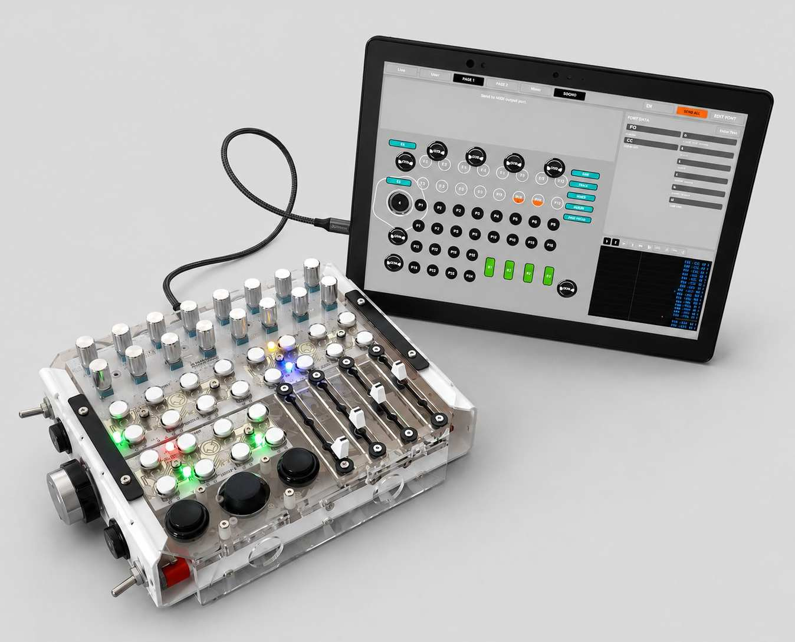
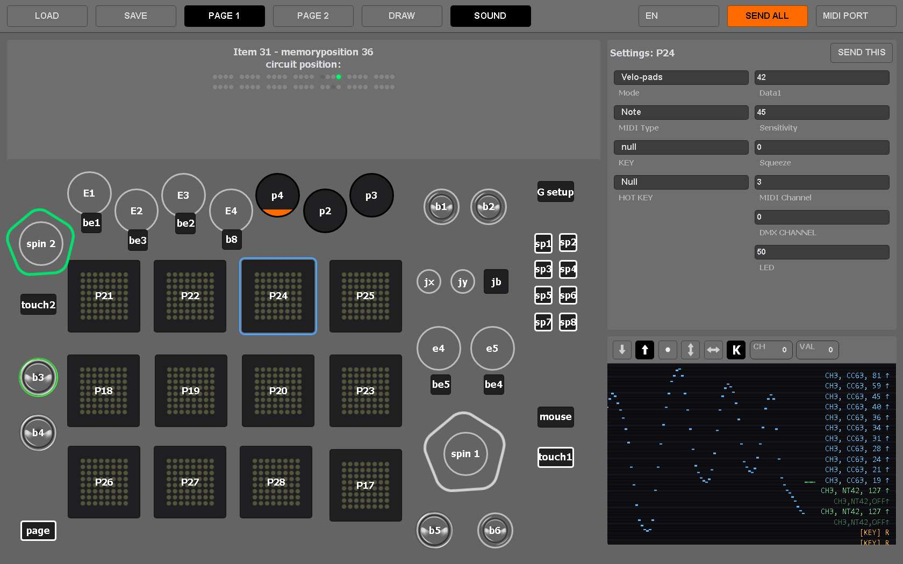
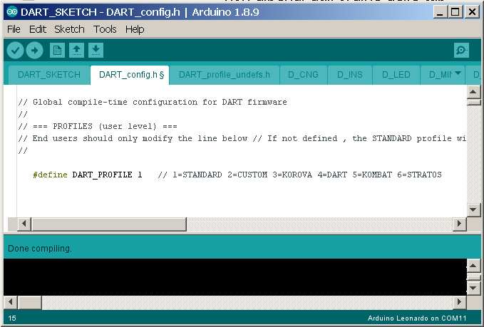
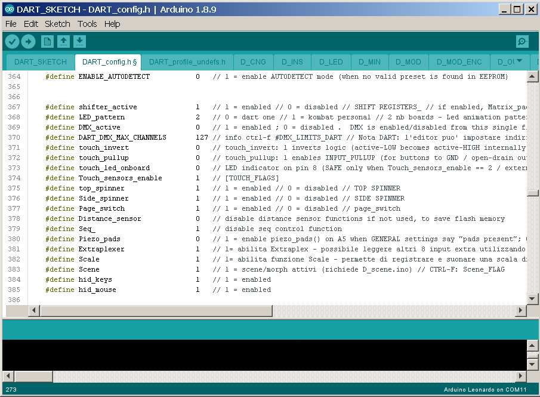
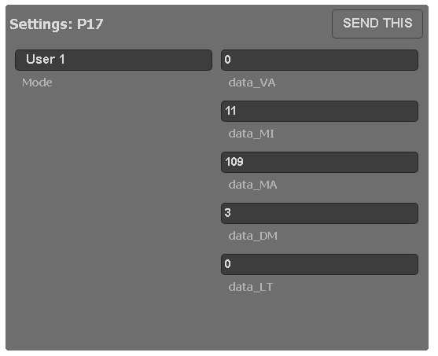
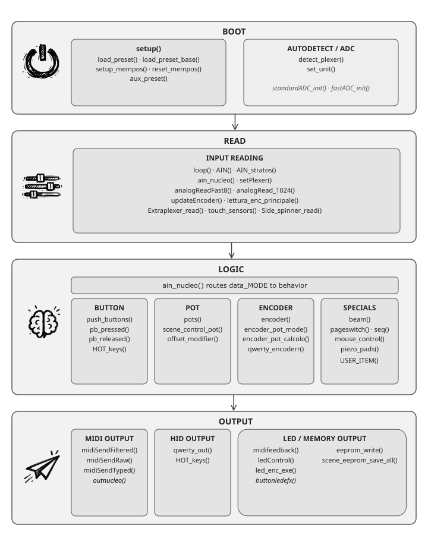
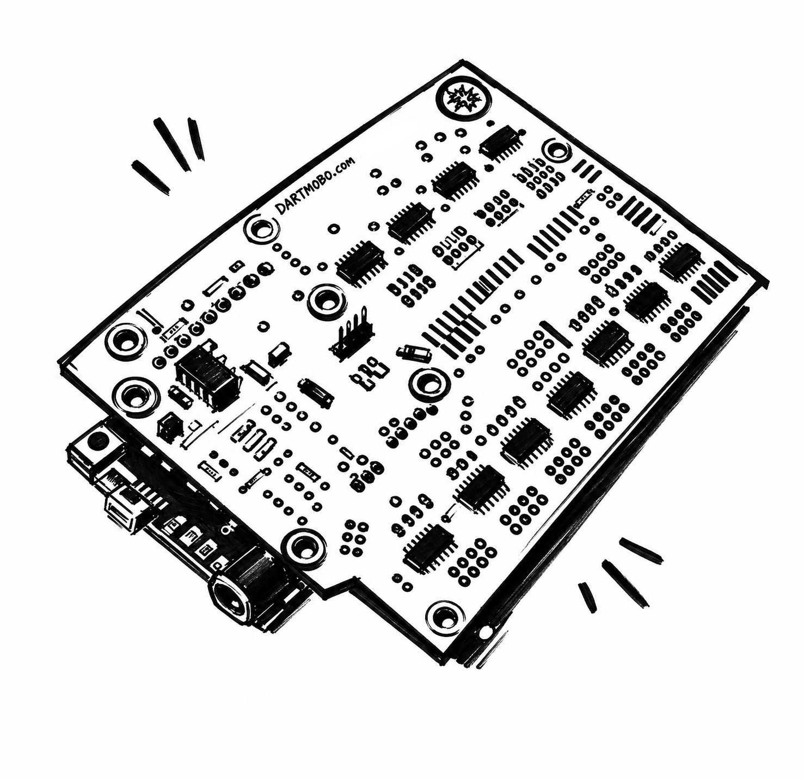

DART Sketch is a universal **MIDI controller firmware** designed to provide useful MIDI activity immediately after upload, then gradually reveal deeper customization tools as the user gains confidence.

It will work for all the units presented on DARTMOBO.COM website, and for any DIY controller based on our framework, automatically adapting to the chosen **Arduino** board: Uno and Leonardoand M0 Metro Express are supported at the moment (other platforms are planned for future releases).
It will work for all the units presented on DARTMOBO.COM website, and for any DIY controller based on our framework, automatically adapting to the chosen **Arduino** board: Uno and Leonardoand M0 Metro Express are supported at the moment (other platforms are planned for future releases).

Thanks to the [**AUTODETECT**](https://dartmobo.com/autodetect/) system, buttons and knobs can begin producing useful MIDI activity almost immediately after the firmware is uploaded, allowing you to focus on building rather than debugging.

All required libraries are already included in the sketch package. Simply extract the archive into a single folder and open **DART_Sketch.ino** in the Arduino IDE.

On Arduino Leonardo boards, **USB MIDI support** is available immediately after upload, making it possible to test your controller within seconds.

As your project grows, the controller can be customized in greater detail through the **[DART Editor](https://dartmobo.com/editor_redirect/)**, without the need to modify the source code.

**PROFILES**

The DART_CONFIG.ino tab of the sketch gives  the possibility to enable/disable some features of the Dart framework, for those who want more control.

Profiles are predefined firmware configurations you can choose, that enable or disable groups of features at compile time.

STANDARD is the default setup. This is the profile selected when downloading the sketch and it is fully compatible with all DIY examples and tutorials presented on the DART website. you don’t have to touch any code line here!

CUSTOM is intended for experimentation and development. It is the recommended profile for users who want to explore the firmware, enable or disable specific modules, test new ideas or build custom hardware configurations.

Profiles such as KOROVA, LIME, STRATOS, ONE and are optimized for specific DART controllers. They contain hardware-specific settings and feature selections tailored for our assembled units and kits.

**DEFINES**

Think of DART as a large facility with many specialized departments. A CUSTOM PROFILE acts like the master power panel: entire sections can be switched on or off before compilation depending on the controller being built.  

These sections are activated by DEFINES.  
Some DEFINES work like simple switches, enabling or disabling a feature. Others behave more like selectors, choosing how a section should operate, while a few act as global tuning controls for memory usage, timing, filtering or array size.

A simple DIY controller may only need a few rooms lit. A professional controller may require additional departments such as touch processing, scene management, mouse control or advanced hardware support. By powering only the sections that are actually needed, DART keeps memory usage under control while preserving a single shared codebase.

The result is one firmware architecture that can adapt to many different controllers without carrying unnecessary baggage.

The STANDARD profile includes extensive inline comments for every DEFINE.
Many features also provide dedicated CTRL+F anchors that lead to deeper explanations, mini-guides and practical examples contained within the sketch package itself, making advanced customization easier for both humans and AI assistants.  

## USER ITEMS

The USER ITEM functions (voids) are the place where the DART firmware stops being a fixed system and it's best starting point to write custom code.

 The standard firmware already includes a large collection of behaviors (grouped in the D_MOD.ino and E_MOD.ino tabs) for buttons, potentiometers, encoders, page system, LEDs, MIDI output, HID keyboard commands and much more. In many cases, the desired result can be achieved simply by configuring the controller from the editor, without writing a single line of code.

However, there are always situations where you want something slightly different. A special shortcut, a custom MIDI behavior, an experimental control method, a strange idea that does not fit any existing MODE. This is exactly why the USER ITEM functions exist.

**EDITOR SIDE**

In the Settings_box of the Dart_editor,   **USER1–USER4** modes allow an item to be processed by your own custom code instead of one of the standard DART behaviors.

**SKETCH SIDE**

When a USER mode is selected, the corresponding function (`user_item1()`, `user_item4()`, etc.) is executed every time that input is scanned.

The Settings Box provides five parameters (selectors) that are  transferred from the editor to the firmware:

_data_VA[], data_MI[], data_MA[], data_DM[], data_LT[]_

Two additional variables are available as free storage bytes for custom code.

_data_VA[chan]  
data_LB[chan]_

All custom variables store values from **0 to 127** and are accessed using the current item index `chan` that identifies the item currently being processed, while `valore` contains its current analog reading (**0–1024**).

## CORE SECTIONS

For those who wish to explore the code, the diagram below provides a simplified overview of the main procedures (voids) that make up the DART Sketch, grouped into four functional areas. A complete and detailed reference can be found directly in the source code, inside **d_guides.ino**, which contains explanations and notes for all major functions.

 DART Sketch was designed and refined around the **[DARTmobo architecture](https://dartmobo.com/dartmobo/dartmobo-diy/)**: a scan-based system built on **74HC4051 multiplexers** and driven by the main input routine, **AIN()**.

 
 The firmware can be easily adapted to smaller projects without multiplexers, and it’s ready for that. Expanding the system beyond the current 56 inputs is certainly possible, but would require a substantial redesign of the internal memory management structure.
 
 ## License
DART_SKETCH is released under **GPL-3.0-or-later**.  
See `LICENSE` for full terms and `THIRD_PARTY_NOTICES.md` for third-party components

